<p align="center">
  
</p>

<h1 align="center">Building a Serverless Website</h1>

<p align="center"><b>Astro + GitHub Actions + Cloudflare Pages.</b> A complete, working example: push to <code>main</code> and your site builds and deploys itself to Cloudflare's global edge, for free.</p>

<p align="center">
  
  
  
  
  <a href="LICENSE"></a>
</p>

---

## What you get

A small but real site you can clone and ship today:

- ⚡ **Astro 6** — ships zero JavaScript by default, so pages are fast.
- 🎨 **Tailwind CSS** — styling without leaving your markup.
- ✍️ **A blog** — dynamic routes via `src/pages/blog/[slug].astro`.
- 🧩 **Components** — a shared `Header`, `Footer` and `Layout`.
- 🔒 **TypeScript** — `astro check` runs on every build.
- 🚀 **Automatic deploys** — GitHub Actions builds and pushes to Cloudflare Pages on every push to `main`.

## Quick start

```bash
git clone https://github.com/ry-ops/building-serverless-website-github-cloudflare.git
cd building-serverless-website-github-cloudflare
npm install
npm run dev
```

Open **http://localhost:4321**.

| Command | What it does |
|---|---|
| `npm run dev` | Dev server with hot reload |
| `npm run build` | `astro check` then `astro build` → `dist/` |
| `npm run preview` | Serve the production build locally |

## Deploy it

**1. Create a Cloudflare Pages project** connected to your fork (Cloudflare Dashboard → Workers & Pages → Create → Pages). Build command `npm run build`, output directory `dist`.

**2. Add two GitHub secrets** (Settings → Secrets and variables → Actions):
- `CLOUDFLARE_API_TOKEN` — a token with the **Cloudflare Pages: Edit** permission
- `CLOUDFLARE_ACCOUNT_ID` — from any zone's Overview page

**3. Push to `main`.** [`.github/workflows/deploy.yml`](.github/workflows/deploy.yml) checks out, `npm ci`, `npm run build`, and deploys `dist/` with `cloudflare/pages-action`.

```bash
git commit -am "Ship it" && git push origin main
```

## How it's laid out

```
src/
├── components/   Header.astro · Footer.astro
├── layouts/      Layout.astro
└── pages/        index.astro · about.astro · blog/[slug].astro
.github/workflows/deploy.yml   build + deploy to Cloudflare Pages
astro.config.mjs · tailwind.config.mjs
```

## Learn more

Three guides walk through the pieces:
- [DEPLOYMENT.md](documentation/DEPLOYMENT.md) — the full deploy path
- [ASTRO-GUIDE.md](documentation/ASTRO-GUIDE.md) — working with Astro
- [CLOUDFLARE-SETUP.md](documentation/CLOUDFLARE-SETUP.md) — Cloudflare Pages

And two worked examples: a [blog setup](examples/blog-setup/) and [API routes](examples/api-routes/).

## License

MIT. See [LICENSE](LICENSE).

<!-- org-footer -->
---

<p align="center"><sub>Part of <a href="https://github.com/ry-ops">ry-ops</a> · building the pipes between infrastructure, automation, and observability · built by <a href="https://github.com/ry-ops">ry-ops</a></sub></p>
